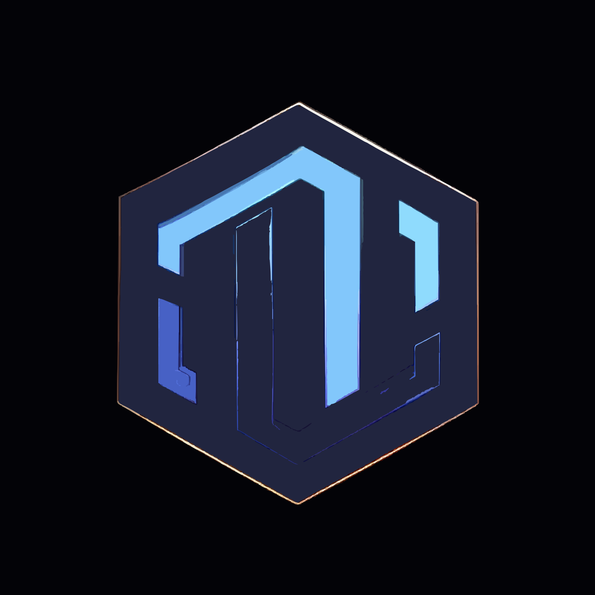

<div align="center">
  
  <h1>PromptIn — Landing Page</h1>
  <p><b>The marketing site for PromptIn, an AI prompt manager browser extension.</b><br/>A Next.js landing page for the extension that organizes prompts across ChatGPT, Claude, Gemini and other AI tools.</p>
  <p>
    <a href="LICENSE"></a>
    
    
    
    
  </p>
</div>

---

Marketing / presentation website for **PromptIn**, an AI prompt manager browser extension for ChatGPT, Claude, Gemini and other AI tools. Built with Next.js.

## Features

- Single-page marketing site with hero, problem/solution, features, social-proof and call-to-action sections plus a blog and privacy page.
- SEO-ready: metadata, Open Graph / Twitter cards, `sitemap.ts` and `robots.ts`.
- Analytics via Vercel Analytics and Google Analytics; scroll tracking.
- Component library based on Radix UI primitives (shadcn/ui style) with light/dark theming.

## Tech

- **Next.js 16** (App Router) + **React 19**
- **TypeScript**
- **Tailwind CSS v4**
- **Radix UI** components, `lucide-react` icons, `framer-motion` animations, `recharts`

## Run

Requires Node.js. Install dependencies and start the dev server:

```bash
git clone https://github.com/olivierluethy/PromptIn-Presentation.git
cd PromptIn-Presentation
npm install        # or: pnpm install
npm run dev
```

Then open <http://localhost:3000>.

To build for production:

```bash
npm run build
npm run start
```

## Project structure

- `app/` — App Router pages (`page.tsx`, `layout.tsx`, `blog/`, `privacy/`), `sitemap.ts`, `robots.ts`
- `components/landing/` — landing-page sections (navbar, hero, features, CTA, footer, …)
- `components/ui/` — reusable UI primitives
- `hooks/`, `lib/`, `styles/`, `public/` — hooks, utilities, styles and static assets

## License

Released under the [MIT License](LICENSE) © 2026 Olivier Lüthy. You're free to use, modify and distribute this
software, including commercially, as long as the copyright notice and license are included.

## Author

Built by **Olivier Lüthy** — [GitHub](https://github.com/olivierluethy).
